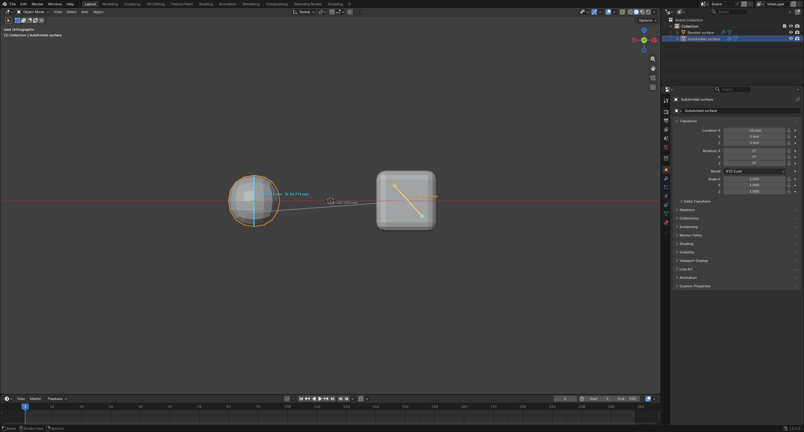
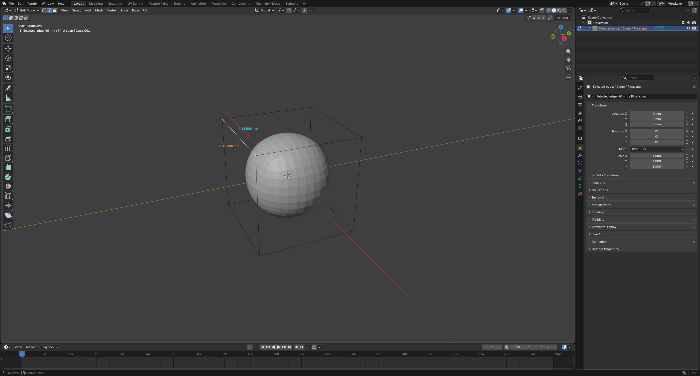
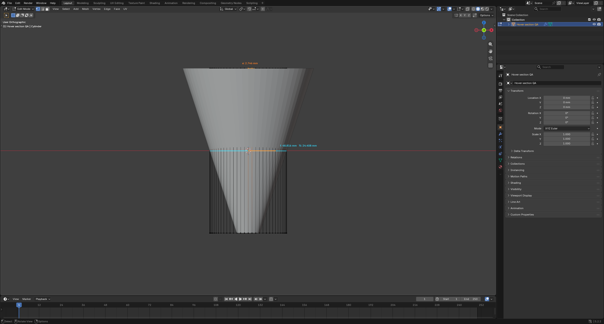

# Как пользоваться Final Dimensions

Сначала [установите расширение](INSTALL_RU.md). Откройте боковую панель: наведите мышь на **3D Viewport**, нажмите **N**, выберите вкладку **Final Dimensions**. Ниже используются английские названия кнопок. ЛКМ — левая, ПКМ — правая кнопка мыши.

## Размеры всей модели

Раскройте блок **Object dimensions** внизу панели — по умолчанию он свёрнут. Здесь находятся World axes, сведения о масштабе единиц сцены и таблица размеров X/Y/Z. Выберите Mesh-объект. Если выделено несколько объектов, таблица относится к **активному** объекту — обычно последнему выбранному. В режиме **Edit Mode** измеряется весь меш, а не только выделенные вершины.

| Подпись | Значение |
| --- | --- |
| **Cage** | Габарит исходных вершин до модификаторов. В Edit Mode учитываются текущие редактируемые вершины. |
| **Final** | Габарит вычисленной модели после модификаторов с текущими настройками Viewport. |
| **Delta** | Final минус Cage: минус означает уменьшение. |
| **%** | Изменение относительно Cage. При нулевом исходном размере процент не определён. |
| **Half** | Половина Final по каждой оси. |

Размеры идут по **мировым осям X/Y/Z**. Поворот меняет занимаемый моделью габарит: у куба со стороной 40 мм после поворота на 45° вокруг Z размеры X/Y будут примерно 56,569 мм. Поэтому значения могут отличаться от **Dimensions** в стандартной вкладке **Item**. Учитываются перенос, вращение, Scale и преобразования родителей.

Не нужно применять модификаторы кнопкой Apply: расширение читает результат, который вычисляет Blender. Для Subdivision используется уровень **Viewport**, а не **Render**. Если модификатор выключен для Edit Mode, результат в этом режиме может отличаться; смотрите предупреждение панели.

### Миллиметры

В редакторе **Properties** откройте **Scene Properties → Units**. Выберите **Unit System: Metric** и **Length: Millimeters**. Расширение учитывает **Unit Scale**. Выбор миллиметров меняет представление размеров, но не увеличивает и не уменьшает геометрию сам по себе. При Unit Scale 1 длина 0,04 единицы Blender отображается как 40 мм; при Unit Scale 0,001 длина 40 единиц тоже соответствует 40 мм.

## Два клика: расстояние между поверхностями

1. Нажмите **Add Ruler** в панели Final Dimensions.
2. Наведите курсор на видимую поверхность Mesh-объекта и нажмите ЛКМ: первая точка закрепится.
3. Переместите курсор на другую точку поверхности. Линия и подпись **d** показывают расстояние до неё во время движения.
4. Нажмите ЛКМ второй раз, чтобы закрепить линейку. Клик в пустоту не закрепляет точку.
5. Для следующей линейки снова нажмите **Add Ruler**. Предыдущие остаются на экране; заданного ограничения на число линеек нет.

Обе точки могут лежать на одном объекте или на разных объектах. Второй объект заранее выбирать не нужно. При **выключенном магните Blender** привязка идёт к поверхности **после модификаторов**, например к сглаженной поверхности Subdivision или скруглению Bevel, доступным во Viewport. По лучу из курсора выбирается ближайшая видимая поверхность.

**d** — прямое расстояние между выбранными точками в трёхмерном пространстве. Это не длина пути по поверхности. Для зазора между деталями вы сами выбираете точки: автоматического поиска минимального зазора нет.

### Привязка к вершинам, рёбрам и граням

Эти настройки относятся к постановке точек кликами, перетаскиванию конца на поверхность и **Replace 1 / Replace 2**. Для перемещения выделенной точки стандартной командой **G** используются штатные настройки snapping Blender; выбор **Snap mesh** относится к инструменту постановки точки расширения.

1. В верхней части **3D Viewport** включите обычный **магнит Blender**. Сочетание **Shift + Tab** переключает его; индикатор **Blender snapping: On / Off** в панели показывает состояние.
2. В меню рядом с магнитом выберите **Vertex**, **Edge** или **Face**. **Edge Midpoint** позволяет привязаться точно к середине ребра. При выборе нескольких режимов подходящие вершины и рёбра имеют приоритет перед свободной точкой грани.
3. В панели Final Dimensions выберите **Snap mesh**:

| Вариант | К чему привязывается точка |
| --- | --- |
| **Original** | К исходным вершинам, рёбрам и граням до модификаторов. В Edit Mode учитывается текущее редактирование базовой сетки. |
| **Final** | К вершинам, настоящим рёбрам и граням результата модификаторов с уровнем Viewport. Можно выбрать новые элементы после Subdivision или Bevel. |
| **Both** | К элементам обеих сеток; этот вариант выбран по умолчанию. Для однозначного выбора перекрывающихся сеток переключитесь на Original или Final. |

4. Создайте линейку или переместите её конец. Наведите мышь близко к нужному элементу: маркер притянется к нему, рядом появится подпись, например **Original · Vertex** или **Final · Edge**. Кликните или отпустите ЛКМ, чтобы закрепить точку.

При **Vertex** выбирается точная вершина; при **Edge** — ближайшая к курсору точка настоящего ребра, а не диагональ, которой Blender разбивает полигон для вычислений; при **Face** — точка грани под курсором. Можно соединить точку Original с точкой Final одной линейкой. Привязка действует при создании, перетаскивании и повторной установке обоих концов.

**Ctrl** временно меняет действие магнита: при включённом магните позволяет свободно выбрать вычисленную поверхность, при выключенном — включает выбранный режим привязки. Изменение магнита, режима и Snap mesh обновляет маркер даже без движения мыши.

В Vertex / Edge точка закрепляется только возле подходящего элемента. Клик между вершинами в режиме Vertex не превращается в привязку к грани. Если при постановке точки выбран только **Increment**, **Grid**, **Volume**, **Edge Perpendicular**, **Face Nearest** или **Face Midpoint**, панель попросит выбрать поддерживаемый режим. Это ограничение инструмента постановки точки; при использовании штатных трансформаций действуют возможности самого Blender.

### Название, цвет и округление подписи

Выберите линейку в списке и нажмите **Label & Color…**:

- **Name** — название перед размером, например «Основная часть». Пустое имя оставляет номер линейки и **d**.
- **Decimals** — число знаков после запятой, от 0 до 6. **Hide trailing zeros** убирает ненужные нули: вместо `2.000 mm` будет `2 mm`. Для размера `2.345 mm` при Decimals 2 подпись станет `2.35 mm`.
- **Custom line color** — отдельный цвет этой линейки. Выключите его, чтобы использовать общий цвет.

Подтвердите диалог кнопкой **OK**. **Cancel / Esc** сохраняет прежнее оформление. Например, имя «Основная часть», единицы Millimeters и включённое скрытие нулей дают подпись **«Основная часть: 2 mm»**. Меняется только отображение: координаты точек и точное вычисленное расстояние сохраняются.

В блоке **Appearance** задаются общий **Line color** и **Inactive brightness** — яркость всех линеек, кроме выбранной. При значении 1 они одинаково яркие; уменьшение затемняет неактивные линии и подписи. У линеек с Custom line color остаётся свой цвет. Линии и маркеры сглаживаются автоматически.

Общие настройки оформления сохраняются со сценой. Названия и индивидуальные настройки принадлежат временным линейкам и очищаются вместе с ними при Undo, загрузке файла или отключении расширения.

### Линейка следует за вершинами одного меша

1. Включите магнит Blender и выберите **Vertex**. В панели Final Dimensions установите **Snap mesh: Original**.
2. Поставьте оба конца линейки на нужные вершины одного объекта. Подпись **Original · Vertex** подтверждает привязку именно к вершине исходной сетки.
3. В **Edit Mode** перемещайте или масштабируйте эти вершины обычными инструментами. Концы линейки следуют за ними, а **d** обновляется во время изменения сетки.
4. После **Inset Faces (I)** привязки к сохранившимся вершинам продолжают работать. Для измерения нового внутреннего контура поставьте точки на его новые вершины, затем меняйте их положение.

Линейка отслеживает ту вершину, которую вы выбрали: новый угол после Inset не заменяет прежний автоматически. Перенумерация вершин или изменение соседней грани не должны переносить привязку на другую вершину. Если закреплённая вершина удалена, затронутый конец нужно поставить заново; второй конец сохраняется.

Для этого расширение использует служебные идентификаторы вершин в атрибуте меша; координаты и топология от добавления идентификаторов не меняются. При неоднозначном результате операции привязка сбрасывается с сообщением, чтобы не показывать размер до чужой вершины.

**Final** измеряет вершины результата модификаторов. Их перемещение отслеживается, пока сохраняется соответствующая топология. Если модификатор перестроил сетку, например изменился уровень Subdivision, созданные им вершины потребуется выбрать заново. Свободная точка поверхности и точка, перенесённая через 3D Cursor/G, отличаются от привязки **Original · Vertex**.

### Выбор точки и стандартные инструменты Blender

**Щёлкните ЛКМ по концу готовой линейки и отпустите кнопку.** Точка остаётся активной. Обычный щелчок не перемещает её — в том числе если она находится внутри объекта. Выбрать конец можно также кнопками **Select Point 1 / Select Point 2** в панели.

Для выбранной точки работают обычные команды Blender:

- **G** — перемещение; **X / Y / Z** ограничивают его выбранной осью, доступны ввод числа и привязка магнитом.
- **R / S** — вращение и масштабирование с текущим **Transform Pivot Point**. Чтобы передвинуть одиночную точку вращением или масштабом, задайте центр вне неё, например **3D Cursor**. При центре в самой точке её положение не изменится.
- **Move / Rotate / Scale** на панели инструментов — стандартное гизмо. Если оно скрыто, проверьте переключатель **Show Gizmos** вверху 3D Viewport. Его перетаскивание мышью пока не подтверждено автотестом; клавиатурные G/R/S проверены.
- **Shift+S** — обычное меню Snap, включая **Selection to Cursor** и **Cursor to Selected**.

Для этих команд расширение временно делает точку настоящим активным объектом Blender. На время её редактирования включается **Object Mode**. **Esc** завершает работу с точкой и возвращает исходный режим и выделение; если сейчас идёт трансформация, первое Esc отменяет её, следующее завершает работу с точкой. Геометрия исходного меша не меняется. Служебная точка удаляется при завершении работы с ней и перед сохранением `.blend`.

После перемещения штатными инструментами конец хранит мировую позицию. Чтобы снова привязать его к деформируемой поверхности с отслеживанием меша, используйте **Replace 1 / Replace 2** и поставьте точку на поверхность.

### Измерение от 3D Cursor, в том числе внутри объекта

1. Установите 3D Cursor в нужное место. Например, выберите объект и используйте обычное **Shift+S → Cursor to Selected**, чтобы поместить курсор в его origin. В Edit Mode эта команда использует выбранные элементы.
2. Создайте линейку или выберите существующую. **Щёлкните по нужному концу и отпустите ЛКМ** — он останется активным.
3. Над 3D Viewport нажмите **Shift+S → Selection to Cursor**. Эта команда переносит только выбранный конец линейки. Точка может находиться внутри объекта: попадание мышью по видимой поверхности для этого не требуется.
4. Второй конец оставьте на поверхности или установите отдельно. Подпись **d** показывает прямое расстояние от позиции курсора до второй точки.

**Shift+S → Cursor to Selected** выполняет обратное действие: ставит 3D Cursor в выбранный конец линейки. Когда работа с точкой завершена, меню снова относится к обычному выделению сцены.

Точка запоминает **мировые координаты курсора в момент команды**. После этого она остаётся на месте, даже если передвинуть 3D Cursor, объект или изменить его модификаторы. Для обновления выберите этот конец и повторите перенос. Курсор не обязан лежать в центре объекта: позицию для измерения задаёте вы.

Команда **Point to 3D Cursor** в панели также доступна при постановке или повторной установке конца.

### Изменение и удаление линейки

Выберите линейку нажатием на её строку с номером в панели. Выбранная линейка отображается ярче. Операции ниже относятся только к ней.

| Действие | Результат |
| --- | --- |
| Щёлкнуть по концу и отпустить ЛКМ | Выделяет его для стандартных команд Blender, сохраняя положение. |
| Зажать ЛКМ возле конца и перетащить | Перемещает этот конец с привязкой к поверхности. Отпустите ЛКМ на поверхности для фиксации. |
| Отпустить ЛКМ в пустоте | Отменяет перетаскивание и возвращает исходную точку. |
| Нажать ПКМ возле выбранного конца | Снимает только эту точку и включает повторную установку. Второй конец остаётся на месте. Следующий ЛКМ на поверхности закрепляет новую точку. |
| **Replace 1 / Replace 2** в панели | Повторно устанавливает соответствующий конец. Если точка потеряна, кнопка называется **Pick Point 1 / Pick Point 2**. |
| **Shift+S → Selection to Cursor** при выбранном конце | Переносит этот конец в текущие координаты 3D Cursor. |
| **Esc** во время перетаскивания или замены | Возвращает исходную точку. |
| **Esc** при создании новой линейки | Удаляет только новую незавершённую линейку. |
| **Backspace** при создании | Сбрасывает первую точку, чтобы выбрать её заново. |
| Кнопка **×** возле Add Ruler в панели | Удаляет только выбранную линейку. Это кнопка интерфейса, не клавиша X на клавиатуре. |

Вдали от концов готовой линейки обычные клики доступны. Поворот вида средней кнопкой мыши и масштабирование колесом работают как обычно. Сечение под мышью временно скрывается, пока вы создаёте или редактируете точку линейки.

Привязки к мешу следуют за его перемещением, вращением, Scale и деформацией. Вершины **Original** отслеживаются по идентичности и могут сохранять привязку после изменений топологии. Для рёбер, граней и **Final** требуется сохранение соответствующей топологии. Если привязка стала недействительной, объект удалён или скрыт, затронутую точку потребуется выбрать заново. Второй конец и другие линейки сохраняются; пояснение появляется в панели.

**Линейки временные:** у каждого окна Blender свой список. Они не записываются в `.blend` и очищаются при загрузке файла, undo/redo и отключении расширения. Чтобы сохранить результат для задания, запишите числа или сделайте снимок экрана до этих действий.

## Offset Cut: разрез на точном расстоянии от грани

Инструмент делает **плоский разрез параллельно выбранной исходной грани**. Он подходит, например, чтобы разрезать куб на 2 мм ниже его верхней стороны. Расстояние измеряется перпендикулярно опорной грани; исходные вершины, положение опоры и внешний размер сохраняются.

1. Выберите Mesh-объект и перейдите в **Edit Mode**. Завершите редактирование активной точки линейки через **Esc**, если оно включено.
2. В блоке **Offset Cut** введите **Distance: `2 mm`**. Поддерживаются явные суффиксы `mm`, `cm`, `m`; можно ввести `0,2 cm`. Число без единиц не принимается.
3. Нажмите **Pick Face & Preview**, наведите мышь на верхнюю плоскую грань исходного куба и щёлкните. Оранжевая рамка обозначает опору, голубые линии — будущий разрез.
4. **Enter / ЛКМ** подтверждает. **Esc / ПКМ** отменяет без изменения сетки. **F** меняет направление отступа относительно нормали той же грани; обычно направление внутрь уже подходит. Во время предпросмотра можно набрать новое значение с единицами, например `1 mm`.
5. **Ctrl+Z** отменяет подтверждённый разрез. Как и остальные Undo в расширении, это действие очищает временные линейки.

При **Metric → Unit Scale 0.001 → Length Millimeters** ввод `2 mm` соответствует ровно 2 мм. При Unit Scale 1 результат тоже составляет 2 мм. Учитываются поворот и неравномерный Scale объекта.

На кубе с фаской выбор **верхней плоской грани** задаёт отсчёт от верхнего уровня. Если выбрать саму плоскую грань фаски, отсчёт пойдёт перпендикулярно ей, а разрез будет наклонным. Отдельный выбор ребра фаски как горизонтальной опоры в этой версии не предусмотрен. При неприменённом Bevel инструмент выбирает исходную сетку до модификатора.

Разрез проходит через связанную часть сетки, к которой относится выбранная грань; отдельные несвязанные части того же объекта сохраняются. Это плоский разрез, а не проход по произвольному кольцу четырёхугольников: на сложной форме может получиться несколько участков. Перемещение уже существующей петли не реализовано. Требуется один редактируемый объект, плоская опора и доступная связанная сетка без скрытых элементов и рёбер с более чем двумя смежными гранями. Shape Keys и общий Mesh у нескольких объектов не поддерживаются. Если плоскость не пересекает деталь, инструмент сообщает об этом.

## Подписи выбранного ребра: e и f

1. Выберите Mesh-объект и нажмите **Tab**, чтобы перейти в **Edit Mode**.
2. Нажмите **2 в верхнем цифровом ряду**, чтобы включить выбор рёбер. Клавиша 2 на цифровом блоке справа выполняет другую команду.
3. Выделите одно ребро. Возле него появятся **e** и **f**.

**e** — длина исходного ребра с учётом преобразований объекта. **f**, когда действительное сечение под мышью не показывается, — полный габарит всего вычисленного объекта вдоль направления этого ребра. Это не длина того же ребра после деформации модификаторами.

Если выбрано несколько рёбер, используется последнее активное ребро в истории выбора. Если Blender не даёт определить его, выберите одно ребро отдельно. При взгляде точно вдоль ребра подписи скрываются: ребро слишком коротко проецируется на экран. Флажок **Selected edge labels** включает и выключает эти подписи. Звёздочка возле **f** означает предупреждение; прочитайте пояснение в панели.

## Сечение под мышью

**Hover section** включён по умолчанию. Для первого измерения:

1. Выберите Mesh-объект, перейдите в Edit Mode и выделите ребро, направленное **поперёк** детали в нужном месте.
2. В панели оставьте **Hover section** включённым и **Plane: Edge + surface**.
3. Наведите мышь на поверхность модели. Голубой контур показывает получившееся сечение. Возле курсора отображаются **f** и **½**.
4. Перемещайте мышь по сечению: направление измерения поворачивается вслед за курсором.

Плоскость проходит через точку поверхности под мышью и содержит направление выбранного ребра и нормаль поверхности в этой точке. Это правило ориентации; расширение не определяет ось произвольной детали автоматически. Если сечение получается наклонным, выберите другое поперечное ребро.

Другой способ — **Plane → Local X / Local Y / Local Z**. Здесь плоскость перпендикулярна выбранной локальной оси объекта. Эти варианты работают и в **Object Mode**, без выбора ребра. Локальные оси поворачиваются вместе с объектом.

**f** — отрезок между границами сечения в направлении от центра площади контура к точке под курсором. **½** — ровно половина этого размера, D/2. Например, на эллипсе наведение на короткую и длинную сторону даёт разные размеры. У некруглой или асимметричной формы **½ не является радиусом кривизны и не обязательно равна расстоянию от центра до границы**.

Если видны несколько отдельных контуров, измеряется тот, на который вы навели мышь; контур отверстия измеряется отдельно. На вогнутой форме линия останавливается при первом выходе за контур. Открытый или некорректный контур, а также неоднозначное направление могут не дать измерения — причина отображается в панели.

Когда мышь уходит с модели, подпись сечения исчезает, а **f** у выбранного ребра возвращается к полному габариту объекта вдоль ребра. **e** остаётся исходной длиной ребра. Отключите **Hover section**, если хотите оставить только измерения ребра.

## Видимость и границы измерений

N-панель можно закрыть: подписи продолжат работать. Кнопка **Show Overlays** в правом верхнем углу 3D Viewport — значок двух пересекающихся окружностей — скрывает все контуры, линейки, маркеры и подписи расширения вместе с остальными наложениями Blender. Наведите на значок, чтобы проверить название во всплывающей подсказке. Когда Overlays выключены, невидимые точки не захватывают мышь.

Таблица и сечение работают с активным Mesh; линейки могут соединять разные видимые Mesh-объекты. Поддерживаются доступные меш-инстансы Geometry Nodes. Кривые, объёмы и другие компоненты не измеряются как меш. **Quad View** не поддерживается. Точность соответствует вычисленной полигональной сетке с текущим уровнем Viewport, а не идеальной математической поверхности. Расширение не проверяет пригодность модели к 3D-печати. Решения типичных проблем — в [FAQ](FAQ_RU.md).
